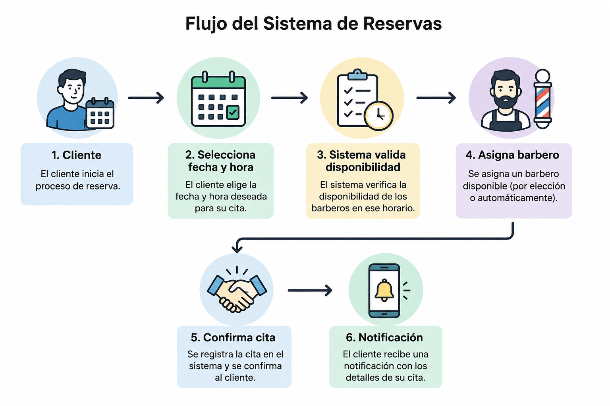

# Casos de Uso

## Reservar una cita con un barbero específico

1. El cliente selecciona un servicio.
2. Elige un barbero.
3. Selecciona fecha y hora.
4. Confirma la reserva.

## Reservar una cita con asignación automática

1. El cliente selecciona un servicio.
2. Elige fecha y hora.
3. El sistema busca barberos disponibles.
4. Se asigna automáticamente uno.
5. Se confirma la reserva.

## Ejemplos de API

=== "Crear cita"

````
```http
POST /api/appointments
```
````

=== "Consultar disponibilidad"

````
```http
GET /api/barbers/availability
```
````

## Imagen del flujo



!!! tip
Se recomienda habilitar notificaciones para recordar las citas programadas.
